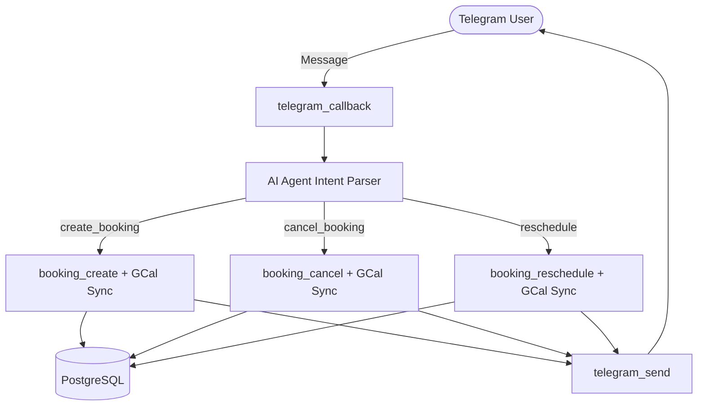
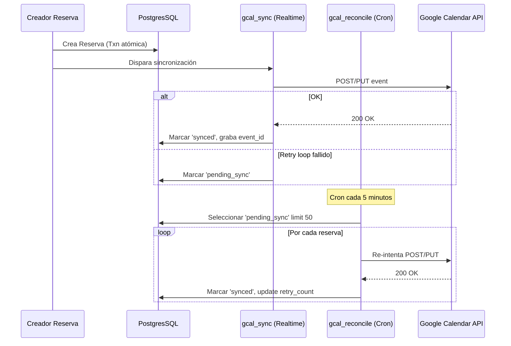

# 📘 Booking Titanium - Windmill (TypeScript)

**Estado:** 🟢 Production Ready (Strict Mode Certified)
**Versión:** 2.0.0
**Lenguaje:** TypeScript (Strict Mode)
**Plataforma:** Windmill Serverless Platform

---

## 📋 Descripción

Sistema de reservas de citas implementado nativamente en **TypeScript** para la plataforma **Windmill**. 
Incluye las operaciones core de creación, cancelación y reagendamiento de reservas médicas o de servicios, utilizando validaciones estrictas y tipado seguro.

### ✅ Features Completas

- **Telegram Webhook** para recibir mensajes de pacientes en tiempo real.
- **AI Agent (LLM)** para detección de intenciones avanzadas (create, cancel, reschedule, reminders) y extracción de entidades.
- **Google Calendar Integration** (Sincronización Bidireccional Activa y Pasiva).
- **Notificaciones (Telegram / Gmail)** para avisos a proveedores y pacientes.
- **Tipado Estricto (TypeScript Strict Mode)** en todas las interacciones con base de datos, usando `postgres.js` v3 tagged templates con tipado estático `RowInterface`.
- **Arquitectura Transaccional Atómica** para proteger operaciones de escritura (`booking_create`, `booking_cancel`, etc.) y prevenir race conditions.
- **Circuit Breaker & Retry queues** (`gcal_reconcile`) para evitar pérdida de sincronización en fallos de red.
- **Vitest Unit & Integration Suites** que garantizan robustez.

---

## 🏗️ Arquitectura & Flujos

### Flujo Principal de Telegram (Webhook → AI → Acción)


### Arquitectura de Sincronización Google Calendar (Eventual Consistency)


---

## 📁 Estructura del Proyecto

```text
booking-titanium-wm/
├── f/                             # Windmill Scripts & Flows
│   ├── internal/                  # Lógica compartida (No expuesta como endpoint directo)
│   │   ├── ai_agent/              # Motor de inteligencia artificial para intents & NLP
│   │   ├── gcal_utils/            # Utilidades compartidas para construcción de eventos GCal
│   │   └── shared_types/          # Tipos compartidos
│   ├── booking_create/            # Operación y Flow de creación atómica
│   ├── booking_cancel/            # Operación de cancelación
│   ├── booking_reschedule/        # Operación de re-agendamiento seguro
│   ├── availability_check/        # Búsqueda de disponibilidad
│   ├── gcal_sync/                 # Sincronización Realtime con GCal
│   ├── gcal_reconcile/            # Cronjob para retry de sincros fallidas
│   ├── telegram_callback/         # Webhook handler nativo para bot de Telegram
│   ├── telegram_send/             # Emisor de mensajes de Telegram
│   └── cron_reminders/            # Disparador de mensajes 24hs/2hs antes de la cita
│
├── docs/                          # Documentación Arquitectónica y Certificaciones
│   ├── AUDIT_REPORTS/
│   └── CERTIFIED_WORKFLOWS.json
│
├── docker-compose.*               # Definición de entornos (Dev/Prod)
├── package.json                   # Dependencias de TS: zod, vitest, postgres...
├── tsconfig.json                  # Conf estricta base
├── tsconfig.strict.json           # Conf estricta de auditoría (noUncheckedIndexedAccess)
└── .env                           # Variables de Entorno (Windmill y Locales)
```

---

## 🚀 Quick Start (Development)

### 1. Variables de Entorno y Dependencias
Clona el `.env.example` y prepara la configuración del entorno para los scripts de Windmill en tu sistema local o subiéndolo como resource en WM.
```bash
cp .env.example .env
npm install                 # Para descargar zod, postgres.js, vitest, etc.
```

### 2. Base de Datos / Infraestructura Local
Puedes levantar la BD local con el docker-compose incluido:
```bash
docker-compose -f docker-compose.dev.yml up -d db
```

### 3. Ejecutar Suites de Pruebas Automáticas (Vitest)
El core lógico se puede testear a nivel local utilizando Vitest en modo estricto. Particularmente útil para la lógica del LLM (ai_agent) y callback handlers.

```bash
# Validacion base
npm run test

# Para modo Type Strict Check (vital para prevenir errores de postgres.js v3)
npm run typecheck
# ó
npx tsc --noEmit
```

---

## 🧱 Guidelines de Desarrollo / Code Standards

1. **Tipado Estricto (Obligatorio en Postgres):** Al usar `postgres.js`, TODAS las queries deben incluir explícitamente el tipado del registro de respuesta mediante interfaces, garantizando seguridad estática (`TS4111`).
   ```typescript
   interface UserRow { id: string, name: string }
   const res = await sql<UserRow[]>`SELECT id, name FROM users`;
   console.log(res[0].name); // ✅ Typo Safe
   ```
2. **Sin Accesos Inseguros a Arrays:** `noUncheckedIndexedAccess` está activo. No debes acceder a elementos de un array sin chequear existencia o utilizar *Optional Chaining* (`arr[0]?.id`).
3. **Validación Zod:** Toda entrada (los parámetros de las funciones `main()` en Windmill) debe ser validada con un schema `.safeParse()` de Zod.

---
**Mantenido por:** Booking Titanium Team (2026)
