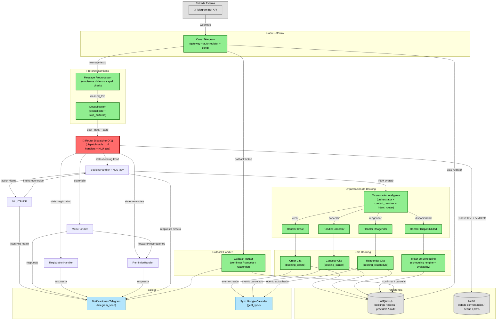

# Diagrama 1 — Subgrafo Activo: Flujo Telegram Booking

> **Leyenda de colores**
> - 🟩 **Verde** — Bloque funcional activo en producción, probado
> - ⬜ **Gris** — Infraestructura base (DB, Redis, externos)
> - 🟦 **Azul claro** — Salidas / Notificaciones
> - 🔴 **Rojo** — Últimos cambios: nextDraft fix + NLU unification + Dispatcher

Flujo principal que opera hoy en producción, representado como bloques funcionales agrupados por capa.



---

## Flujo de mensajes paso a paso

### Ruta 1: Mensaje de texto (usuario escribe)

```
Telegram → Gateway → Preprocessor (modismos + spell check) → Deduplicate
  → Router Dispatcher O(1) (lookup por estado en Redis)
    → state=idle          → MenuHandler (keywords: 1-5, "mis citas", "info")
    → state=registration  → RegistrationHandler (sí/no/nombre/teléfono/email)
    → state=reminders     → ReminderHandler (rem:ch:, rem:w:, rem:off)
    → state=booking FSM   → BookingHandler (FSM transition + NLU lazy fallback)
    → 🔴 nextState + nextDraft → Redis (draft preservado entre transiciones)
    → respuesta → Telegram Send
```

### Ruta 2: Callback de botón inline (usuario presiona botón)

```
Telegram → Gateway → Callback Router (directo, sin preprocessor ni dispatcher)
  → confirmar/cancelar/reagendar → DB + Google Calendar
  → respuesta → Telegram Send (edit message)
```

### 🔴 Últimos cambios implementados

| Cambio | Archivos | Impacto |
|--------|----------|---------|
| **nextDraft Fix** | `_booking_handler.py`, `_fsm_machine.py` | Draft se preserva entre transiciones FSM (specialty → doctor → time → confirm) |
| **NLU Unification** | `nlu/_tfidf_classifier.py`, `ai_agent/_tfidf_classifier.py` | Clasificadores unificados, entities type corregido a `dict[str, str]` |
| **Lazy NLU Loading** | `_booking_handler.py` | NLU solo corre si FSM no resuelve (~80% ahorro CPU) |
| **Dispatcher O(1)** | `telegram_router/` (4 handlers) | Router de 567 → 22 líneas, lookup O(1) por estado |
| **Archive telegram_normalize** | `f/_archived/telegram_normalize/` | Lógica inlined en webhook trigger; módulo preservado como referencia |

### NLU Lazy — cuándo se ejecuta

| Escenario | ¿NLU corre? | Razón |
|-----------|------------|-------|
| Usuario escribe "1" | ❌ No | MenuHandler resuelve por keyword |
| Usuario escribe "sí" en registro | ❌ No | RegistrationHandler resuelve por estado |
| Usuario escribe "quiero una cita" sin teléfono | ✅ Sí | FSM no resuelve → NLU detecta `crear_cita` |
| Usuario escribe "hola" en idle | ✅ Sí | MenuHandler no match → NLU detecta `saludo` |
| Usuario escribe "xyzqwerty" | ✅ Sí | NLU → confidence=0 → "no entendí" |
| Usuario presiona botón inline | ❌ No | Callback Router, sin NLU |

### 🔴 nextDraft Fix — cómo funciona

```
FSM State (ConfirmingState)
  └── draft: DraftCore { specialty_id, doctor_id, start_time, ... }
        ↓
extract_draft_from_state(state)
  └── retorna DraftBooking con datos acumulados
        ↓
RouterResult { nextState: ..., nextDraft: {...} }
  └── Redis guarda draft para siguiente iteración
```

**Antes:** `nextDraft=None` → draft se perdía en cada transición  
**Después:** `nextDraft=extract_draft_from_state(nextState)` → draft se preserva

---

## Mapeo de bloques a archivos

| Bloque | Archivos |
|--------|----------|
| Canal Telegram | `telegram_gateway`, `telegram_send`, `telegram_auto_register` |
| Message Preprocessor | `message_preprocessor/main`, `_modism_mapper`, `_spell_normalizer` |
| Deduplicación | `telegram_deduplicate` (con `_SKIP_PATTERNS` regex) |
| **🔴 Router Dispatcher O(1)** | `telegram_router/main` (22 líneas), `telegram_router/_dispatch_table`, `telegram_router/handlers/_*` |
| **🔴 NLU Lazy** | `nlu/_tfidf_classifier` (llamado solo desde BookingHandler) |
| **🔴 extract_draft_from_state** | `booking_fsm/_fsm_machine.py` (nueva función) |
| Callback Router | `telegram_callback`, `_callback_logic`, `_callback_router` |
| Orquestador Inteligente | `booking_orchestrator`, `_context_resolver`, `_intent_router`, `handlers/_*` |
| Crear Cita | `booking_create`, `_create_booking_logic`, `_booking_create_repository` |
| Cancelar Cita | `booking_cancel`, `_cancel_booking_logic`, `_cancel_booking_repository` |
| Reagendar Cita | `booking_reschedule`, `_reschedule_logic`, `_reschedule_repository` |
| Motor de Scheduling | `scheduling_engine`, `availability_check` |
| Notificaciones Telegram | `telegram_send` |
| Sync Google Calendar | `gcal_sync` |
| ~~Normalización~~ | ~~`telegram_normalize`~~ → **archivado** (lógica inlined en webhook trigger) |
