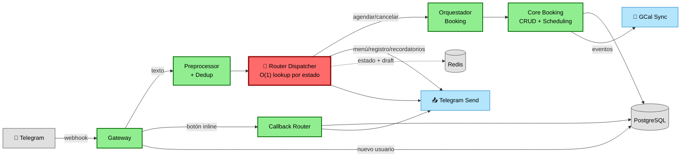

# Diagrama 1 — Subgrafo Activo: Flujo Telegram Booking

> **Leyenda de colores**
> - 🟩 **Verde** — Activo en producción
> - ⬜ **Gris** — Infraestructura (DB, Redis, externos)
> - 🟦 **Azul** — Salidas / Notificaciones
> - 🔴 **Rojo** — Cambios recientes

Flujo principal que opera hoy en producción.



---

## Detalle del Router Dispatcher

El **Router Dispatcher** es un lookup O(1) por estado conversacional en Redis:

| Estado en Redis | Handler | Qué hace |
|-----------------|---------|----------|
| `idle` | MenuHandler | Menú principal, info, mis datos, mis citas |
| `registration` | RegistrationHandler | FSM registro (nombre → teléfono → email) |
| `reminders_config` | ReminderHandler | Configurar recordatorios |
| `selecting_specialty` → `confirming` | BookingHandler | FSM booking (5 estados) + NLU lazy fallback |

**NLU Lazy:** Solo se ejecuta cuando el BookingHandler no puede resolver la acción (~20% de mensajes). Ahorra ~80% CPU en clasificación.

---

## Flujo paso a paso

### Ruta 1: Mensaje de texto

```
Telegram → Gateway → Preprocessor → Deduplicate
  → Router Dispatcher (lookup O(1) por estado en Redis)
    → idle          → Menú principal
    → registration  → Registro (nombre/teléfono/email)
    → reminders     → Configurar recordatorios
    → booking FSM   → Wizard de agendamiento (specialty → doctor → hora → confirmar)
       → si no resuelve → NLU TF-IDF fallback
    → respuesta → Telegram Send
    → estado + draft → Redis
```

### Ruta 2: Callback de botón

```
Telegram → Gateway → Callback Router
  → confirmar/cancelar/reagendar → DB + GCal
  → respuesta → Telegram Send (edit message)
```

---

## Últimos cambios

| Cambio | Impacto |
|--------|---------|
| **nextDraft Fix** | Draft se preserva entre transiciones FSM |
| **NLU Unification** | Entities type corregido a `dict[str, str]` |
| **Lazy NLU** | Solo corre si FSM no resuelve (~80% ahorro CPU) |
| **Dispatcher O(1)** | Router de 567 → 22 líneas |
| **Archive normalize** | Lógica inlined en webhook trigger |

---

## Mapeo a archivos

| Bloque | Archivos |
|--------|----------|
| Gateway | `telegram_gateway`, `telegram_send`, `telegram_auto_register` |
| Preprocessor | `message_preprocessor/main`, `_modism_mapper`, `_spell_normalizer` |
| Deduplicación | `telegram_deduplicate` |
| **🔴 Router Dispatcher** | `telegram_router/main` (22 líneas), `_dispatch_table`, `handlers/_*` |
| **🔴 NLU Lazy** | `nlu/_tfidf_classifier` |
| **🔴 extract_draft_from_state** | `booking_fsm/_fsm_machine.py` |
| Callback Router | `telegram_callback` |
| Orquestador | `booking_orchestrator` + `handlers/_*` |
| Core Booking | `booking_create`, `booking_cancel`, `booking_reschedule`, `scheduling_engine` |
| Persistencia | `PostgreSQL` + `Redis` |
| Salidas | `telegram_send`, `gcal_sync` |
