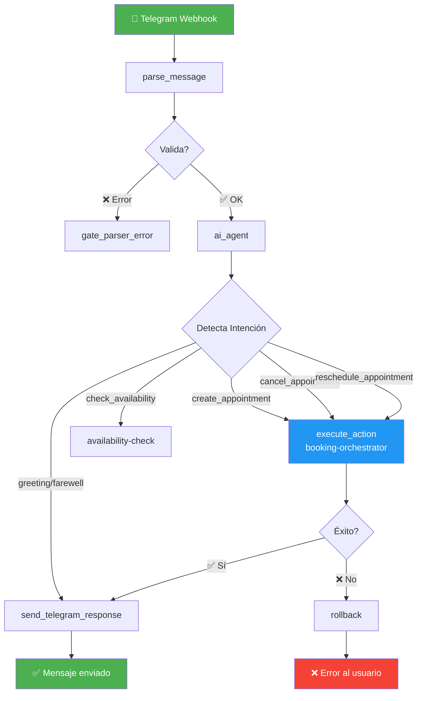
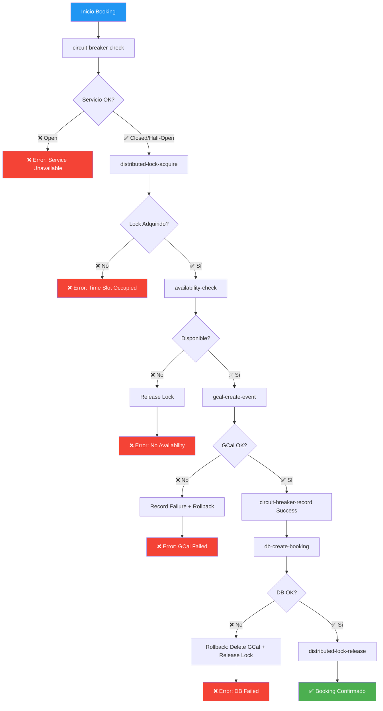
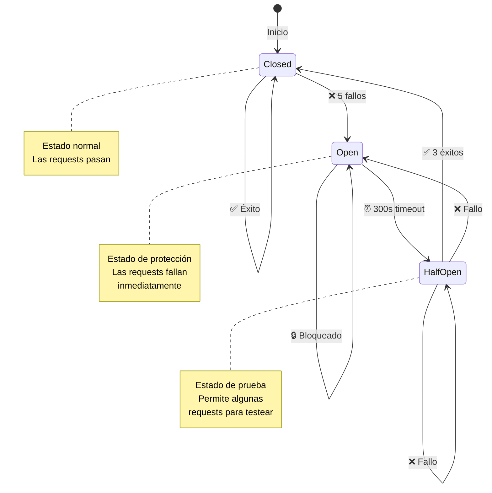
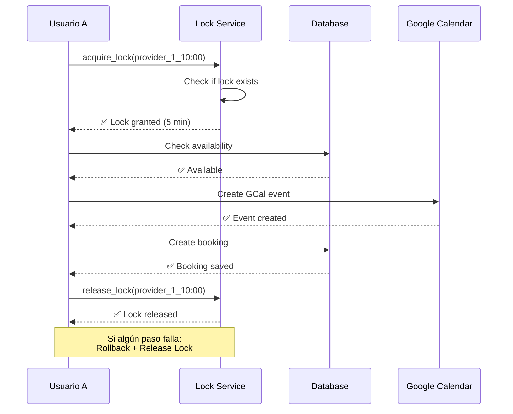
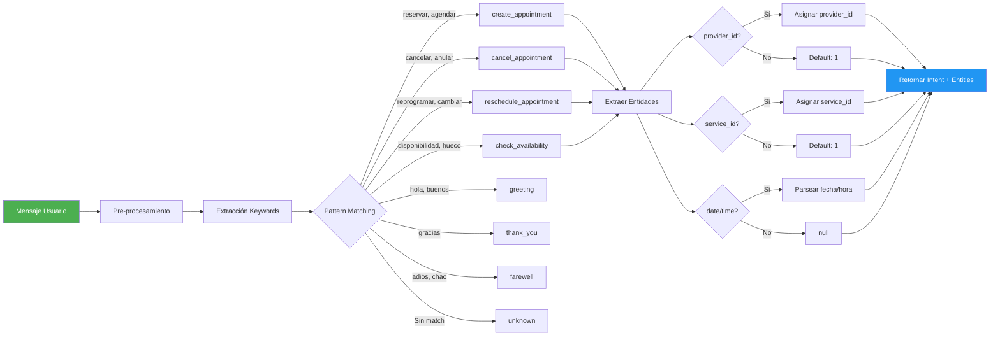
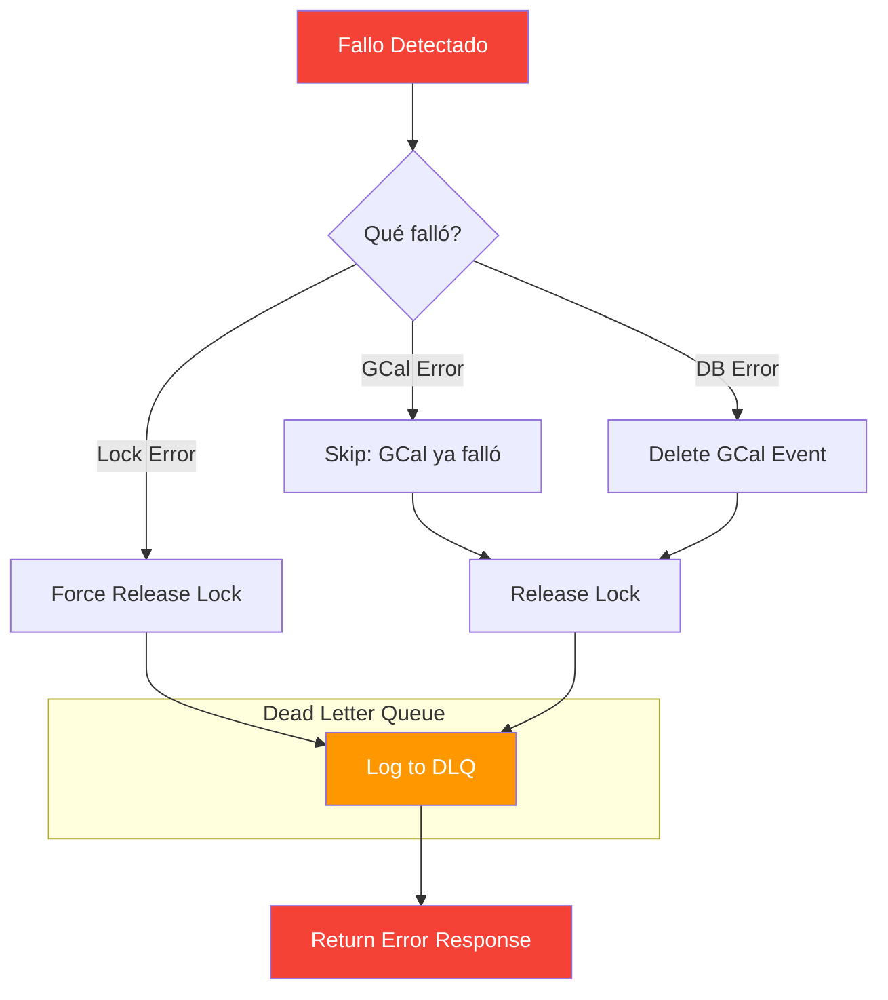
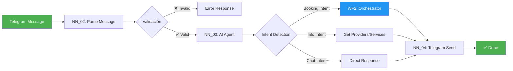
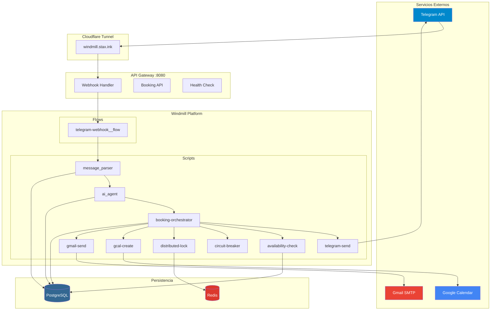

# 📊 Diagramas de Flujos - Booking Titanium

Este documento contiene diagramas Mermaid que visualizan los flujos del sistema.

---

## 1. Telegram Webhook Flow (NN_01 Equivalente)

**Descripción del Flujo:**
1. **Webhook Trigger**: Recibe POST de Telegram
2. **Parse Message**: Valida chat_id y texto (NN_02)
3. **AI Agent**: Detecta intención del usuario (NN_03)
4. **Execute Action**: Ejecuta booking-orchestrator
5. **Send Response**: Envía confirmación por Telegram

---

## 2. Booking Orchestrator Flow (WF2 Equivalente)

**Pasos del Orchestrator:**
1. **Circuit Breaker Check**: Verifica si GCal está saludable
2. **Distributed Lock**: Bloquea el time slot (5 min)
3. **Availability Check**: Verifica disponibilidad real
4. **GCal Create Event**: Crea evento en Google Calendar
5. **Circuit Breaker Record**: Registra éxito
6. **DB Create Booking**: Guarda en PostgreSQL
7. **Lock Release**: Libera el lock

---

## 3. Circuit Breaker Pattern

**Estados:**
- **Closed**: Normal, todas las requests pasan
- **Open**: Protección activa, todas las requests fallan
- **Half-Open**: Prueba, permite algunas requests

---

## 4. Distributed Lock Pattern

**Características del Lock:**
- **Key**: `lock_{provider_id}_{start_time}`
- **Duración**: 5 minutos
- **Auto-release**: Expira automáticamente
- **Owner token**: UUID para validar ownership

---

## 5. AI Agent Intent Detection

**Intenciones Soportadas:**
| Intención | Keywords | Acción |
|-----------|----------|--------|
| `create_appointment` | reservar, agendar, citar | Crear booking |
| `cancel_appointment` | cancelar, anular, eliminar | Cancelar booking |
| `reschedule_appointment` | reprogramar, cambiar, mover | Reschedule booking |
| `check_availability` | disponibilidad, hueco, libre | Check availability |
| `greeting` | hola, buenos días/tardes | Saludo |
| `thank_you` | gracias, agradezco | Agradecimiento |
| `farewell` | adiós, chao, hasta luego | Despedida |

---

## 6. Rollback Workflow (WF6 Equivalente)

**Pasos del Rollback:**
1. **Detectar fallo**: En qué paso falló?
2. **Delete GCal**: Si se creó evento, eliminarlo
3. **Release Lock**: Liberar time slot
4. **Log to DLQ**: Registrar para debugging
5. **Error Response**: Retornar error al usuario

---

## 7. Message Processing Pipeline

---

## 8. Sistema Completo - Vista de Arquitectura

---

## Cómo Ver Estos Diagramas

### Opción 1: GitHub
Los archivos `.md` con Mermaid se renderizan automáticamente en GitHub.

### Opción 2: VS Code
Instala la extensión:
- **Markdown Preview Mermaid Support**

### Opción 3: Mermaid Live Editor
Copia el código y pégalo en:
- https://mermaid.live/

### Opción 4: Windmill UI
Para ver los flujos reales:
1. Ve a `https://windmill.stax.ink`
2. Navega a `f/telegram-webhook__flow`
3. Click en "Flow" tab para ver el diagrama visual

---

**Última actualización:** 2026-03-26
**Mantenido por:** Booking Titanium Team
