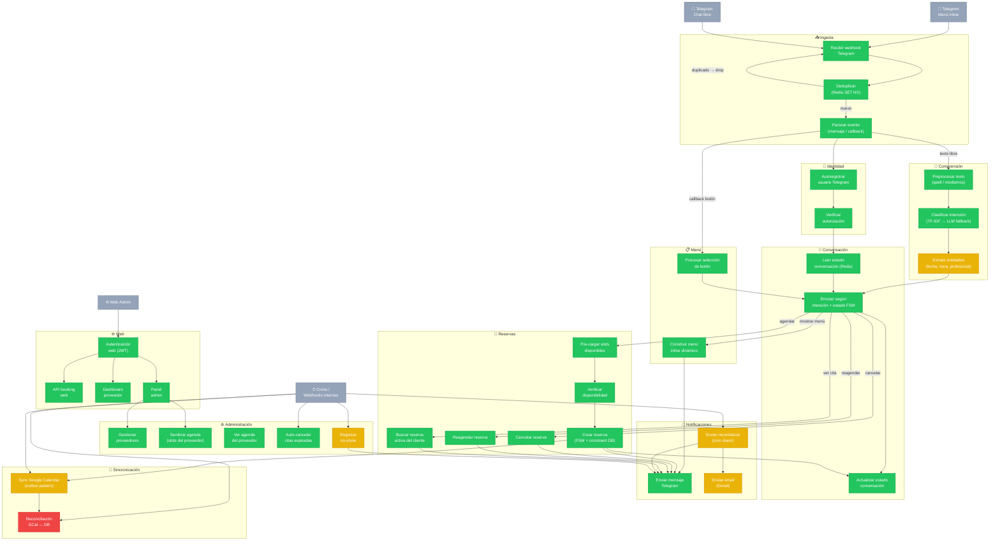

# Grafo Funcional del Sistema de Reservas

## Técnica de Desarrollo: Walking Skeleton + Feature Slicing

**Principio**: cada nodo es una función de negocio independiente. Se construye primero el esqueleto completo con stubs (placeholders que devuelven datos hardcoded), y luego se reemplaza nodo por nodo con el módulo real ya probado.

**Estado de nodos:**
- 🟢 Verde (`:::done`) — implementado y con tests passing
- 🟡 Amarillo (`:::partial`) — implementado parcialmente o sin cobertura completa
- 🔴 Rojo (`:::stub`) — placeholder / pendiente de implementar

---

## Flujo Principal: Telegram → Reserva



---

## Mapa de Módulos → Nodos funcionales

| Nodo funcional | Módulo(s) Windmill | Estado |
|---|---|---|
| Recibir webhook | `f/telegram_gateway` | 🟢 |
| Deduplicar | `f/internal/telegram_deduplicate` | 🟢 |
| Parsear evento | `f/flows/telegram_webhook/intake.py` | 🟢 |
| Autoregistrar usuario | `f/telegram_auto_register` | 🟢 |
| Verificar autorización | `f/auth_provider` | 🟢 |
| Preprocesar texto | `f/message_preprocessor` | 🟢 |
| Clasificar intención | `f/internal/telegram_classify` + `f/nlu` | 🟢 |
| Extraer entidades | `f/internal/message_parser` | 🟡 |
| Leer estado conversación | `f/internal/conversation_get` | 🟢 |
| Actualizar estado | `f/internal/conversation_update` | 🟢 |
| Enrutar FSM | `f/internal/telegram_router` | 🟢 |
| Construir menú | `f/telegram_menu` | 🟢 |
| Procesar botón | `f/telegram_callback` | 🟢 |
| Pre-cargar slots | `f/internal/booking_prefetch` | 🟢 |
| Verificar disponibilidad | `f/availability_check` | 🟢 |
| Crear reserva | `f/internal/booking_confirm` + `f/services/booking/core` | 🟢 |
| Cancelar reserva | `f/booking_cancel` | 🟢 |
| Reagendar reserva | `f/booking_reschedule` | 🟢 |
| Buscar reserva | `f/booking_search` | 🟢 |
| Enviar Telegram | `f/telegram_send` | 🟢 |
| Enviar email | `f/gmail_send` | 🟡 |
| Recordatorio | `f/reminder_cron` + `f/reminder_config` | 🟡 |
| Sync GCal | `f/gcal_sync` | 🟡 |
| Reconciliación GCal | `f/gcal_reconcile` | 🔴 |
| Auto-cancelar expiradas | `f/auto_cancel_expired` | 🟢 |
| No-show | `f/noshow_trigger` | 🟡 |
| Gestionar proveedores | `f/provider_manage` | 🟢 |
| Agenda proveedor | `f/provider_agenda` | 🟢 |
| Sembrar agenda | `f/admin_schedule_seed` | 🟢 |
| Auth web | `f/web/auth_*` | 🟢 |
| API booking web | `f/web/booking_api` | 🟢 |
| Dashboard proveedor | `f/web/provider_dashboard` | 🟢 |
| Panel admin | `f/web/admin_*` | 🟢 |

---

## Protocolo Walking Skeleton para nuevos flujos

```
1. DEFINIR el nodo como stub en el grafo (🔴)
2. CREAR el script Windmill con main() que devuelve datos hardcoded
3. CONECTAR el nodo al flujo (flow.yaml o llamada directa)
4. VERIFICAR que el flujo end-to-end llega hasta Telegram (humo)
5. REEMPLAZAR el stub con el módulo real ya desarrollado
6. TESTEAR el módulo en aislamiento (pytest, sin red/DB)
7. DESPLEGAR y validar en staging con datos reales
8. MARCAR el nodo como 🟢
```

> **Regla**: nunca conectes un nodo sin que el flujo completo pueda ejecutarse de punta a punta, aunque sea con datos fake.
