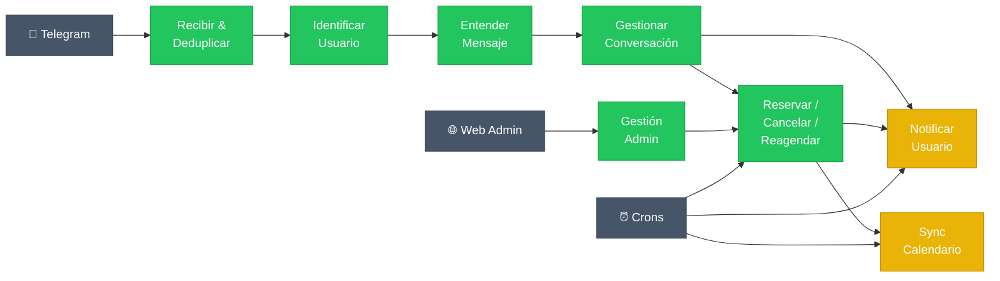

# Visión General del Sistema de Reservas

```mermaid
flowchart LR
    classDef done    fill:#22c55e,color:#fff,stroke:#16a34a
    classDef partial fill:#eab308,color:#fff,stroke:#ca8a04
    classDef stub    fill:#ef4444,color:#fff,stroke:#dc2626
    classDef external fill:#475569,color:#fff,stroke:#334155

    TG["📱 Telegram"]:::external
    WEB["🌐 Web Admin"]:::external
    CRON["⏰ Crons"]:::external

    GATEWAY["Recibir &\nDeduplicar"]:::done
    IDENTITY["Identificar\nUsuario"]:::done
    NLU["Entender\nMensaje"]:::done
    FSM["Gestionar\nConversación"]:::done
    BOOKING["Reservar /\nCancelar /\nReagendar"]:::done
    NOTIFY["Notificar\nUsuario"]:::partial
    SYNC["Sync\nCalendario"]:::partial
    ADMIN["Gestión\nAdmin"]:::done

    TG --> GATEWAY
    GATEWAY --> IDENTITY
    IDENTITY --> NLU
    NLU --> FSM
    FSM --> BOOKING
    FSM --> NOTIFY
    BOOKING --> NOTIFY
    BOOKING --> SYNC
    WEB --> ADMIN
    ADMIN --> BOOKING
    CRON --> BOOKING
    CRON --> NOTIFY
    CRON --> SYNC
```

🟢 implementado · 🟡 parcial · 🔴 pendiente
