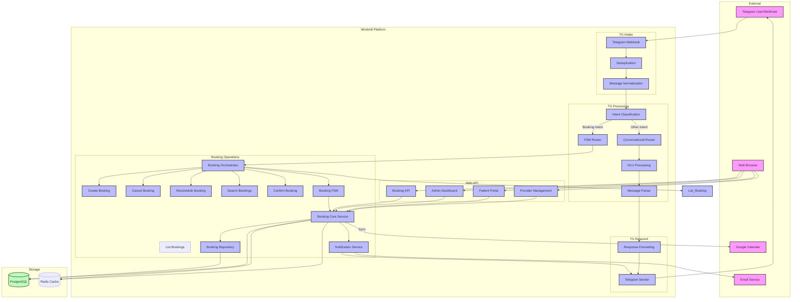

```mermaid
flowchart TD
    %% External Systems
    subgraph External
        TG[Telegram User/Webhook]
        GCal[Google Calendar]
        Email[Email Service]
        Web_Browser[Web Browser]
    end

    %% Windmill Components
    subgraph Windmill[Windmill Platform]
        %% Telegram Processing Flow (3-step architecture)
        subgraph TG_Intake[TG Intake]
            Webhook[Telegram Webhook]
            Dedup[Deduplication]
            Normalize[Message Normalization]
        end

        subgraph TG_Process[TG Processing]
            Classify[Intent Classification]
            FSM_Router[FSM Router]
            Conv_Router[Conversational Router]
            NLU[NLU Processing]
            Message_Parser[Message Parser]
        end

        subgraph TG_Respond[TG Respond]
            Response_Formatter[Response Formatting]
            TG_Send[Telegram Sender]
        end

        %% Booking Operations
        subgraph Booking[Booking Operations]
            Orchestrator[Booking Orchestrator]
            Create_Booking[Create Booking]
            Cancel_Booking[Cancel Booking]
            Reschedule_Booking[Reschedule Booking]
            List_Bookings[List Bookings]
            Search_Booking[Search Bookings]
            Confirm_Booking[Confirm Booking]
            FSM_Machine[Booking FSM]
            Core_Service[Booking Core Service]
            Repo[Booking Repository]
            Notifier[Notification Service]
        end

        %% Web API
        subgraph Web_API[Web API]
            Booking_API[Booking API]
            Admin_Dashboard[Admin Dashboard]
            Patient_Portal[Patient Portal]
            Provider_Management[Provider Management]
        end
    end

    %% Data Storage
    subgraph Storage
        PG[(PostgreSQL)]
        Redis[(Redis Cache)]
    end

    %% Telegram Flow
    TG --> Webhook
    Webhook --> Dedup
    Dedup --> Normalize
    Normalize --> Classify
    Classify -->|Booking Intent| FSM_Router
    Classify -->|Other Intent| Conv_Router
    FSM_Router --> Orchestrator
    Conv_Router --> NLU
    NLU --> Message_Parser
    Message_Parser --> Response_Formatter
    Orchestrator --> Create_Booking
    Orchestrator --> Cancel_Booking
    Orchestrator --> Reschedule_Booking
    Orchestrator --> List_Booking
    Orchestrator --> Search_Booking
    Orchestrator --> Confirm_Booking
    Orchestrator --> FSM_Machine
    FSM_Machine --> Core_Service
    Core_Service --> Repo
    Repo --> PG
    Core_Service --> Redis
    Core_Service --> Notifier
    Notifier --> Email
    Notifier --> TG_Send
    Core_Service -->|Sync| GCal
    Response_Formatter --> TG_Send
    TG_Send --> TG

    %% Web API Flow
    Web_Browser --> Booking_API
    Web_Browser --> Admin_Dashboard
    Web_Browser --> Patient_Portal
    Web_Browser --> Provider_Management
    Booking_API --> Core_Service
    Admin_Dashboard --> Core_Service
    Patient_Portal --> Core_Service
    Provider_Management --> Core_Service
    Core_Service --> PG
    Core_Service --> Redis

    %% Styling
    classDef external fill:#f9f,stroke:#333,stroke-width:2px;
    classDef windmill fill:#bbf,stroke:#333,stroke-width:2px;
    classDef storage fill:#bfb,stroke:#333,stroke-width:2px;
    class TG,GCal,Email,Web_Browser external;
    class Webhook,Dedup,Normalize,Classify,FSM_Router,Conv_Router,NLU,Message_Parser,Response_Formatter,TG_Send,Orchestrator,Create_Booking,Cancel_Booking,Reschedule_Booking,List_Booking,Search_Booking,Confirm_Booking,FSM_Machine,Core_Service,Repo,Notifier,Booking_API,Admin_Dashboard,Patient_Portal,Provider_Management windmill;
    class PG,Reds storage;
```