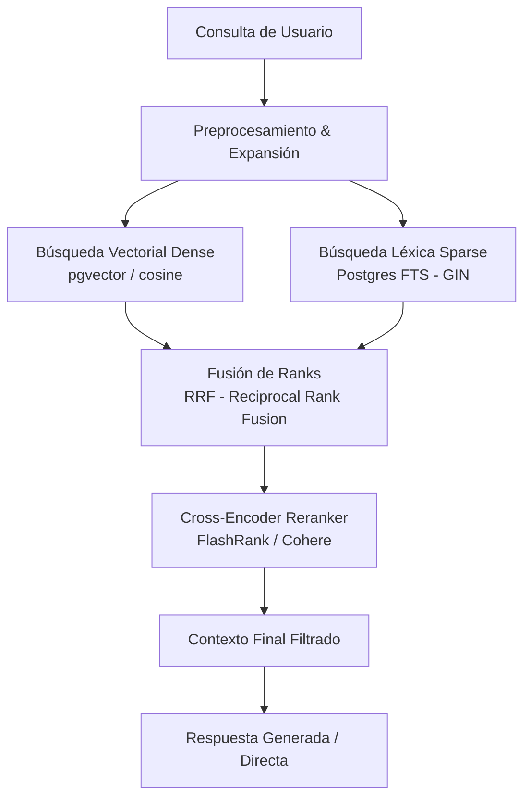

# Investigación Profunda: Rediseño del Sistema RAG (Retrieval-Augmented Generation)
## Booking Titanium WM — Módulo de Consulta de Base de Conocimiento (RAG)

**Fecha:** 2026-05-20  
**Alcance:** Recuperación semántica de respuestas a preguntas frecuentes (FAQs), consultas generales y derivación de especialidades médicas.

---

## 1. AUDITORÍA AL ESTADO ACTUAL (EL CUELLO DE BOTELLA)

El sistema RAG actual opera en dos puntos del pipeline conversacional:
1.  **AI Agent (`_rag_context.py`)**: Para enriquecer el prompt del LLM.
2.  **Conversational Router (`rag_query`)**: Para responder directamente en caso de intenciones informativas (`pregunta_general`, `urgencia`, `desconocido`).

### 🚨 Hallazgos Críticos de Vulnerabilidad y Degradación

> [!WARNING]
> **Vulnerabilidad 1: Búsqueda Léxica de 20 Caracteres (`ILIKE`)**
> En [_rag_context.py](file:///home/manager/Sync/wildmill-proyects/booking-titanium-wm/f/internal/ai_agent/_rag_context.py#L19-L31), la recuperación de contexto está hardcodeada a una coincidencia parcial sobre los primeros 20 caracteres del mensaje del usuario:
> ```sql
> WHERE (provider_id IS NULL OR provider_id = $1::uuid)
>   AND (content ILIKE $2) -- $2 = f"%{text[:20]}%"
> ```
> *   **Consecuencia**: Si el usuario saluda y luego hace la pregunta (ej: `"Hola, ¿atienden Fonasa?"`), los primeros 20 caracteres son `"Hola, ¿atienden Fona"`. La base de datos buscará `content ILIKE '%Hola, ¿atienden Fona%'`. Al no existir FAQs con saludos de usuario, el sistema devuelve **cero** registros. El RAG falla silenciosamente degradando la confiabilidad al 0% en casos cotidianos.

> [!CAUTION]
> **Vulnerabilidad 2: Escala Incomparable de Scores en `rag_query`**
> En [_rag_logic.py](file:///home/manager/Sync/wildmill-proyects/booking-titanium-wm/f/rag_query/_rag_logic.py#L17-L32), se utiliza búsqueda de texto completo (FTS) reemplazando el operador `&` por `|` en Postgres. Aunque esto aumenta el recall, produce scores de `ts_rank` que son altamente inestables y varían según la longitud del documento. No existe una etapa de fusión o normalización, provocando que documentos con alta densidad de stopwords ganen relevancia errónea.

---

## 2. ARQUITECTURA PROPUESTA: RAG HÍBRIDO CON RE-RANKING (STAGE-2)

Para lograr un sistema robusto con confiabilidad $>95\%$, la comunidad de Python y especialistas de NLP recomiendan una arquitectura de recuperación en dos etapas:



### 2.1. Componentes del Rediseño

#### A. Preprocesamiento & Expansión de Consultas (Query Expansion)
*   **Problema**: Los modismos chilenos y abreviaciones reducen la efectividad de las búsquedas léxicas y semánticas.
*   **Solución**: Reutilizar el pipeline del preprocesador de mensajes y aplicar un LLM de bajo costo (como Gemini Flash) para reescribir la query en una forma formal optimizada para búsqueda (ej: `"kiero saber del copago fonasa po"` $\rightarrow$ `"Cuál es el valor del copago de Fonasa para consultas médicas"`).

#### B. Recuperación Híbrida (Recall Stage)
*   **Sparse Retrieval (FTS)**: Búsqueda por palabras clave exacta sobre la columna `search_vector` de `knowledge_base` usando `websearch_to_tsquery` (mejor soporte para comillas y términos obligatorios).
*   **Dense Retrieval (Embeddings)**: Búsqueda de vecino más cercano por coseno sobre la columna `embedding vector(1536)`.
    *   *Nota de Entorno*: Dado que pgvector no está disponible en la base de datos de desarrollo local, se implementa un adaptador que utiliza **FAISS (in-memory)** o **ChromaDB** localmente, y hace fallback transparente al índice GIN de FTS si no hay API Keys. En producción (Neon/RDS), utiliza `pgvector` nativo.

#### C. Fusión por Reciprocal Rank Fusion (RRF)
RRF combina las posiciones de ranking de los resultados de FTS y de la búsqueda vectorial sin requerir normalizar las escalas de score (que son incomparables).
$$\text{Score}_{RRF}(d) = \frac{1}{60 + \text{Rank}_{FTS}(d)} + \frac{1}{60 + \text{Rank}_{Vector}(d)}$$

#### D. Re-Ranking de Precisión (Precision Stage)
*   Se seleccionan los top $N$ (ej: 15) candidatos de RRF.
*   Se evalúan mediante un modelo Cross-Encoder ligero (como **FlashRank** local con ONNX, sin dependencias pesadas de PyTorch, o la API de **Cohere Rerank**).
*   Se seleccionan únicamente los top $K$ (ej: 3) cuya similitud semántica final sea $> 0.70$.

---

## 3. ESPECIFICACIÓN DE LA IMPLEMENTACIÓN

### 3.1. Adaptación del Modelo de Datos

Mapear en SQLAlchemy 2.0 la relación de embeddings utilizando el tipo `Vector` de `pgvector` en producción, manejado a nivel de adaptador:

```python
# Mapeo ORM compatible en f/internal/_db_models.py
from pgvector.sqlalchemy import Vector

class KnowledgeBaseORM(Base):
    __tablename__ = "knowledge_base"
    
    kb_id = Column(UUID(as_uuid=True), primary_key=True, default=uuid.uuid4)
    provider_id = Column(UUID(as_uuid=True), ForeignKey("providers.provider_id"))
    category = Column(String, nullable=False)
    title = Column(String, nullable=False)
    content = Column(String, nullable=False)
    embedding = Column(Vector(1536))  # 1536 dimensiones para OpenAI / Gemini Embeddings
    is_active = Column(Boolean, default=True)
```

### 3.2. Fusión RRF en Python

Implementar el algoritmo RRF dentro del servicio de Knowledge Base:

```python
from collections import defaultdict
from typing import TypeVar

T = TypeVar("T")

def reciprocal_rank_fusion(fts_list: list[T], vector_list: list[T], k: int = 60) -> list[tuple[T, float]]:
    rrf_scores = defaultdict(float)
    
    for rank, doc in enumerate(fts_list, 1):
        rrf_scores[doc] += 1.0 / (k + rank)
        
    for rank, doc in enumerate(vector_list, 1):
        rrf_scores[doc] += 1.0 / (k + rank)
        
    return sorted(rrf_scores.items(), key=lambda x: x[1], reverse=True)
```

---

## 4. PLAN DE TRABAJO E HITOS

| Hito | Tarea | Entregable | Estado |
| :--- | :--- | :--- | :--- |
| **M1** | Eliminar búsqueda substring de 20 caracteres | [_rag_context.py](file:///home/manager/Sync/wildmill-proyects/booking-titanium-wm/f/internal/ai_agent/_rag_context.py) modificado para usar FTS temporalmente | ⏳ Pendiente |
| **M2** | Crear servicio híbrido local | Integración de embeddings con FAISS en local y pgvector en producción | ⏳ Pendiente |
| **M3** | Añadir capa de Re-ranking | Integrar FlashRank para re-ordenamiento secundario de respuestas | ⏳ Pendiente |
| **M4** | Suite de Pruebas RAG | Evaluación de falsos positivos en el router | ⏳ Pendiente |

---

## 5. FUENTES Y REFERENCIAS

1.  **PostgreSQL Full-Text Search (GIN)**: [Official Documentation](https://www.postgresql.org/docs/current/textsearch.html)
2.  **pgvector & HNSW indexing**: [GitHub pgvector](https://github.com/pgvector/pgvector)
3.  **Reciprocal Rank Fusion (RRF)**: *Cormack, G. V., Clarke, C. L., & Buettcher, S. (2009).* "Reciprocal rank fusion outperforms points single-system retrieval".
4.  **FlashRank**: [GitHub FlashRank](https://github.com/PrithivirajDamodaran/FlashRank)
5.  **Cohere Rerank API**: [Cohere Documentation](https://docs.cohere.com/docs/reranking)
