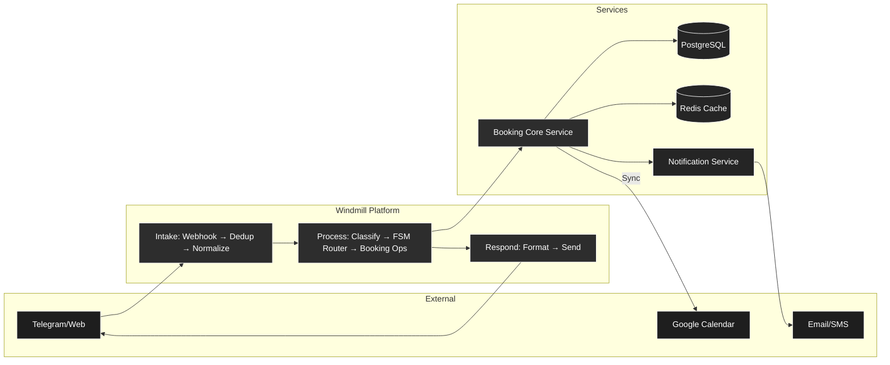

```mermaid
flowchart LR
    %% External Systems
    subgraph External
        TG[Telegram/Web]
        GCal[Google Calendar]
        Email[Email/SMS]
    end

    %% Windmill Core
    subgraph Windmill[Windmill Platform]
        direction TB
        Intake[Intake: Webhook → Dedup → Normalize]
        Process[Process: Classify → FSM Router → Booking Ops]
        Respond[Respond: Format → Send]
        
        Intake --> Process
        Process --> Respond
    end

    %% Data & Services
    subgraph Services
        PG[(PostgreSQL)]
        Redis[(Redis Cache)]
        Notifier[Notification Service]
        Core[Booking Core Service]
    end

    %% Connections
    TG --> Intake
    Respond --> TG
    
    Process --> Core
    Core --> PG
    Core --> Redis
    Core --> Notifier
    Core -->|Sync| GCal
    Notifier --> Email
    
    %% Styling - Dark Mode
    classDef external fill:#1e1e1e,stroke:#ffffff,color:#ffffff,stroke-width:1px;
    classDef windmill fill:#2d2d2d,stroke:#ffffff,color:#ffffff,stroke-width:1px;
    classDef services fill:#252525,stroke:#ffffff,color:#ffffff,stroke-width:1px;
    class TG,GCal,Email external;
    class Intake,Process,Respond,Core windmill;
    class PG,Redis,Notifier services;
```